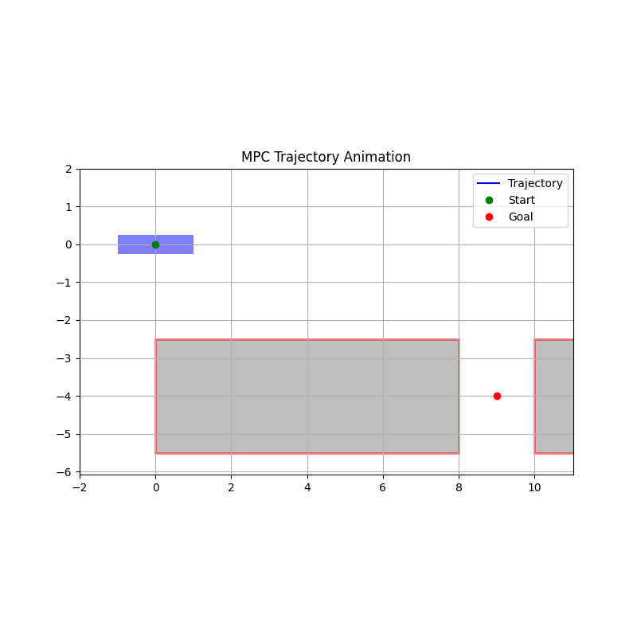
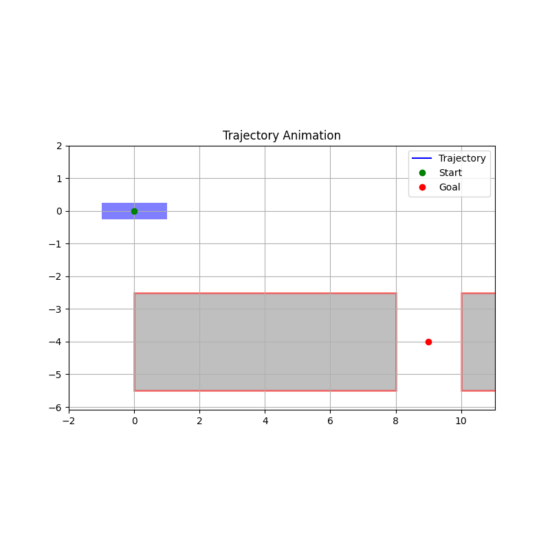

# MAE271D-Seminar
Code for HWs and Project for MAE271D Course at UCLA

## Homework 2
Implemented optimization-based collision avoidance for autonomous reverse parking of a full-dimensional rectangular car using MPC and one-shot OCP.

# MPC:

# One-shot OCP:

